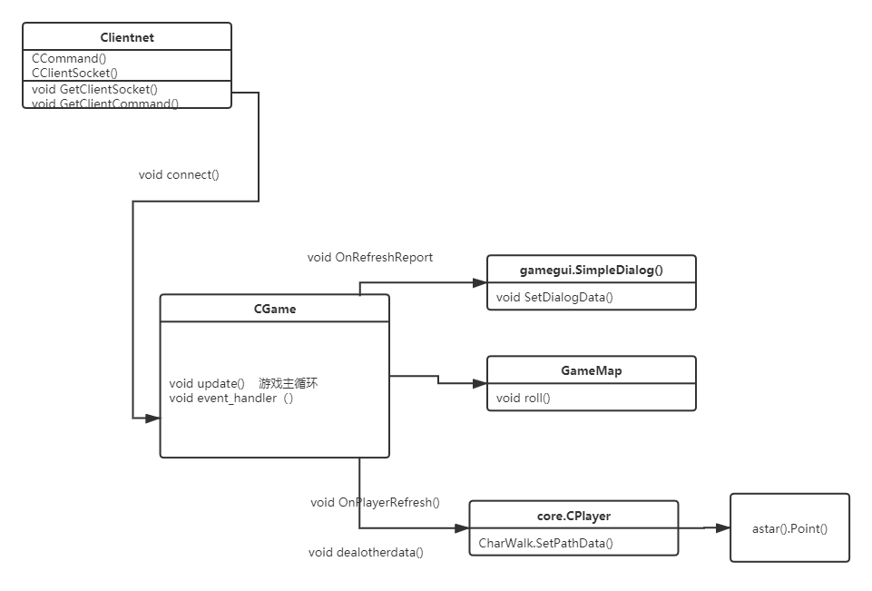
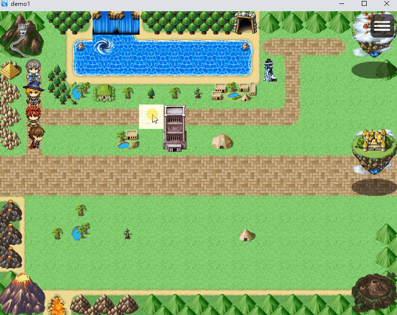

## pygame网络游戏设计——客户端


### **课程目的**

PyGame网络游戏的设计，旨在模拟MMORPG类型游戏的玩法实现，使得新手对网络游戏有初步的认识。该游戏案例课程的重点是在后端服务器的设计部分，学员可重点理解该部分的代码设计， PyGame前端为次要部分，作为Python基础语法知识的巩固和深入学习。


### 类图




**解释**

- 在设计上，CGame作为游戏主体，update游戏主循环，程序开始main()，类初始化__init__()，进入游戏主循环update()， 按键监测event_handler()，上传目标坐标C2SPlayerMove()，服务器返回寻路路径OnPlayerRefresh， 客户端设置路径寻路SetPathData()，客户端移动寻路逻辑logic()。检测战斗逻辑CheckFight()， 协议进入战斗C2SFight()，协议请求战报C2SReadReport()， 设置gui显示字符OnRefreshReport()。运行gui显示字符app.run(),  


### **代码文件说明**

前端设计分为以下几部分为了解，game, core,  astar,  gamegui，clientnet

game文件， 定义了CGame类， 作为整个游戏类， 游戏主循环逻辑在CGame类里面的update方法设计实现，

core文件， 定义了玩家类CPlayer， 和与之相关的人物行走类CharWalk， 承载人物在地图上同步显示行走的逻辑。

astar文件， 主要是定义了行走的点类

gamegui文件， 主要是运用PGU模块，定义了弹窗显示界面的逻辑， 

clientnet文件， 主要承接与服务器通信的作用。观察者模式中的被观察者，游戏主体CGame为观察者。（学员重点熟悉观察者模式）

其他文件，start.bat,  main,  main9 

start.bat 是客户端一键启动文件，会启动已固定账户的main 和 main9 两个客户端，

**运行环境说明**

模块版本如下：

```python
 python 3.6.0

 pygame 2.0.1

 pgu 0.18

```


### **观察者模式：Clientnet 函数注册**		

***重点***

客户端和服务器连接需要先注册函数，

协议注册

```python
RegisterCommand(1, OnNotify)
RegisterCommand(2, OnLoginSuc)
RegisterCommand(3, OnLoginFail)
RegisterCommand(4, OnPlayerRefresh)
RegisterCommand(5, OnRefreshReport)
```

```python
#登录成功
def OnLoginSuc(lstArg):
 	print("login success?", lstArg)
 	return True

#登录失败
def OnLoginFail(lstArg):
 	print("login Fail", lstArg)

#刷新人物状态，可能包含有别人的人物
def OnPlayerRefresh(*args):
 	print('**OnPlayerRefresh**\n服务器回传数据：%s\n'%args)
 	print(args)
 	return args[-1]
```


### **思考拓展**

1. 实现多人组队寻路同步。

   

   

2. 思考游戏战斗的实现。


